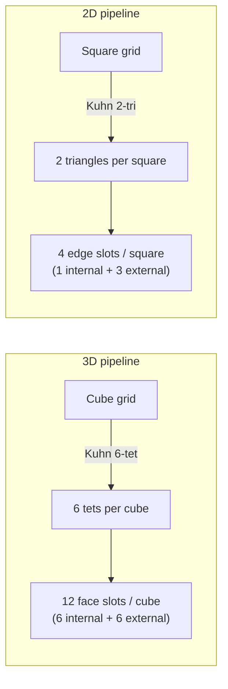

# 2D vs 3D pipelines

mojoxm ships **two parallel pipelines**: a 3D tetrahedral path with MPI
support, and a 2D triangle path that's single-rank GPU-only but cheaper to
develop against and faster to iterate on. They share the same `Physics`
trait, the same SSPRK3 stage plan, and (mostly) the same BC menu.

## When to use each

| Want to…                                              | Use         |
| ----------------------------------------------------- | ----------- |
| Run a 3D production simulation on a multi-GPU cluster | **3D**      |
| Iterate on a new physics module / Riemann solver      | **2D first**|
| Validate a shock-limiter change at multiple P         | **2D first**|
| Test MPI halo-exchange logic                          | **3D**      |
| Get answers fastest (z-uniform, single-GPU box)       | **2D**      |

The 2D path runs at **~17 K SSPRK3 steps/sec** on a 64×64 mesh on an RTX
3090; the 3D path runs at **~1.2 GDOF/s** on a 32³ mesh. For an apples-to-
apples convergence study at small mesh, 2D wall-clocks tend to be 5–10×
faster because the per-element working set is so much smaller.

## What's shared

| Concern                          | Shared? | Notes                                                           |
| -------------------------------- | ------- | --------------------------------------------------------------- |
| `Physics` trait + 4 hooks        | ✓       | Same struct definitions; `numerical_flux` is just 2D vs 3D normal |
| SSPRK3 stage plan                | ✓       | `src/ssprk3.ssprk3_stage_plans` is non-templated, used by both  |
| Conservation diagnostics         | ✓       | `DiagnosticsWriter` works in either dimension                   |
| BC constants                     | ✓       | `BC_WALL` / `BC_OUTFLOW` / `BC_INFLOW` from `src/boundary.mojo` |
| BJ limiter design                | ✓       | Same 3-kernel split (cell_mean → compute_theta → apply)         |
| VTU writer pattern               | ✓       | `vtu.mojo` (3D) and `vtu_2d.mojo` (2D)                          |

## What differs

### Mesh decomposition

Both decompositions share the translation-invariance property: every cube
(square) is decomposed identically, so the `(face_local, side) → element-local
node` map is a small precomputed table.

### Kernel launch pattern

| Stage                          | 3D                                          | 2D                                        |
| ------------------------------ | ------------------------------------------- | ----------------------------------------- |
| Per SSPRK3 stage               | **1 launch** — fused `rk_stage_kernel`      | **2 launches** — face flux → fused vol+lift+RK |
| Limiter (when on)              | 3 launches (cell_mean / compute_theta / apply) | Same                                   |

The 3D kernel is a *cooperative* shared-memory kernel — one thread block
per element, threads cooperate within the block to compute volume, face,
and lift contributions for all `N_P` nodes in a single launch. Working
set per element is up to **504 q-values** at `NC=9 / NP=56` — the largest
config in the suite.

The 2D kernel is per-`(elem, node)` parallel, with `fstar` materialised in
global memory between the two launches. Phase-3 fusion (single launch
in 2D) is on the roadmap; the 2D Brio–Wu retry has confirmed that the
remaining bottleneck is the Rusanov flux quality, not launch overhead.

### MPI

3D supports MPI multi-rank with periodic and non-periodic BCs:

- `src/partition.mojo` factorises `nprocs` into `(PX, PY, PZ)` minimising
  ghost-exchange surface.
- `src/halo_exchange.mojo` implements the pack / Isend / Irecv / unpack
  protocol with per-direction BC-skip flags.
- `mpi_advection_test` and `mpi_bc_test` gate `np=1 ↔ np=4`
  bit-identicality.

2D is **single-rank GPU only**. Adding 2D MPI is on the roadmap.

### Cost story (limiter share)

The same BJ limiter is proportionally heavier in 2D than 3D, because
the 3D cooperative kernel grows quadratically with NP and absorbs the
budget:

| P | 2D limiter share | 3D limiter share |
| - | ---------------- | ---------------- |
| 2 | ~40%             | ~15%             |
| 3 | ~44%             | ~14%             |
| 4 | ~48%             | ~12%             |
| 5 | ~45%             | ~11%             |

So a 1.5× speedup in the 2D limiter is a 1.5× speedup of nearly half the
runtime — roughly 18% end-to-end. The same change in 3D buys ~4%.

## File layout

| File / module                                | Pipeline | Role                                            |
| -------------------------------------------- | -------- | ----------------------------------------------- |
| `src/reference.mojo`                         | 3D       | Reference tet, D, Lift                          |
| `src/local_mesh.mojo`                        | 3D       | Periodic Kuhn-tet mesh + BC overlay             |
| `src/mesh.mojo`                              | 3D       | Patch-aware MPI mesh, ghost rings               |
| `src/halo_exchange.mojo`                     | 3D       | MPI pack / Isend / Irecv                        |
| `src/solver.mojo`                            | 3D       | `Solver[PhysT, P]`, `rk_stage_kernel`, BJ limiter |
| `src/<physics>.mojo`                         | 3D       | Physics modules (one each)                      |
| `src/reference_2d.mojo`                      | 2D       | Reference triangle                              |
| `src/local_mesh_2d.mojo`                     | 2D       | Host-side periodic Kuhn-tri mesh + BC overlay   |
| `src/local_mesh_2d_gpu.mojo`                 | 2D       | `LocalMesh2DGpu[P]` upload + cell-mean kernel   |
| `src/local_mesh_2d_gpu_<physics>.mojo`       | 2D       | Per-physics 2D pipeline (5 modules + GLM-MHD)   |
| `src/local_mesh_2d_gpu_limiter.mojo`         | 2D       | 2D BJ limiter                                   |
| `src/vtu.mojo` / `src/vtu_2d.mojo`           | each     | VTU writers                                     |

The 2D path's per-physics modules are intentionally **separate compilation
units** — one for each of (Advection, Euler, SW, IdealMHD plain NC=6,
IdealMHD GLM NC=7, Maxwell). This avoids a templated mega-module and
makes binary sizes manageable.

## Validation parity

Both pipelines have full P-parity coverage across all 5 smooth physics
at \(P = 2 / 3 / 4 / 5\), plus shocked Euler at every supported P. The
benchmark suite categorises:

- **2D smooth (43 gates)** — see `bench-quick`, `bench-rates`, `bench-p5`,
  per-physics aggregators
- **2D shocks + EM (18 gates)** — `bench-shocks`, `bench-bcs`
- **3D smooth (58 gates)** — same shape, 3D versions
- **3D shocks (7 gates)** — Sod, Brio–Wu, dam break

See [Usage · Benchmarks](../usage/benchmarks.md) for how to run subsets.
