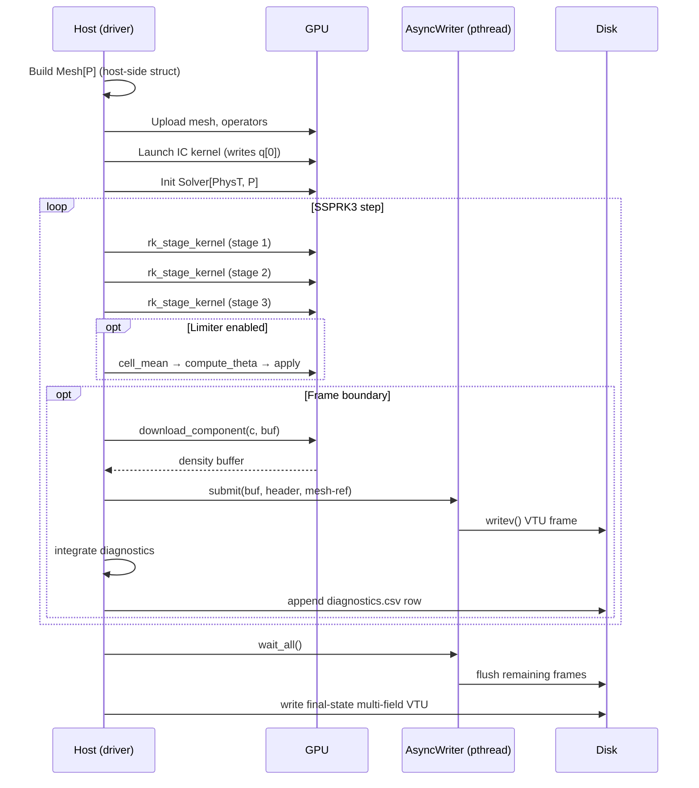

# Data flow

This page traces a single timestep from the driver entry point through the
GPU kernels and out to disk.

## End-to-end view



## Mesh build (host → GPU, once)

`src/mesh.mojo` and `src/local_mesh.mojo` build a periodic Kuhn-tet mesh on
host, then call two GPU build kernels that materialise the device-resident
arrays. After this point, **no host-side array indexed by element, face, or
DOF survives**. The host keeps:

- A pointer to `elem_node_xyz` (zero-copy reference for the VTU writer)
- BC dispatch tables (small, host-side OK)
- Solver scalar config (dt, T_FINAL, etc.)

Everything else lives on the device.  Sample breakdown for an
Euler vortex run at \(P=2, 32^3\) (NC=5, num_elements = 6 × 32³ =
196,608) — the categories `Solver.memory_report()` actually prints:

| Category                   | Size at \(P=2, 32^3\)         |
| -------------------------- | ----------------------------- |
| `q` buffers (×3, RK stages)| 112.5 MB (`3 · num_elements · N_P · NC · Float32`) |
| Mesh connectivity          | 84.8 MB (`elem_node_xyz` + Jacobians + face tables + permutations) |
| Cell limiter scratch       | 4.5 MB                        |
| DG operators               | 2.1 KB (`D_ref` + `Lift_ref` + `node_weights`) |
| **Total device memory**    | **~202 MB**                   |

Every example driver prints this as a startup banner via
`Solver.memory_report().print()`.

## SSPRK3 step

The actual time-stepper lives in `src/time_integrator.mojo`:

```mojo
def run_ssprk3_loop[PhysT: Physics](
    solver: Solver[PhysT, P], writer: FrameWriter[PhysT, P],
    dt: Float32, T_final: Float32, num_frames: Int, nvtx: NvtxShim,
) -> StepperResult:
    var t = Float32(0.0)
    var step = 0
    while t < T_final:
        solver.step(dt)        # 3 launches (1 per SSPRK3 stage)
        if solver.cell_limiter_enabled():
            solver.limit()     # 3 launches (cell_mean / theta / apply)
        if step_is_frame(step):
            writer.write_frame(solver, step, t)
        t += dt
        step += 1
    return StepperResult(...)
```

`solver.step()` does the buffer-routing dance — read two of the three q
buffers, write the third, rotate. The actual permutation comes from the
non-templated `ssprk3_stage_plans` helper.

## Frame I/O (single-field async path)

Per-frame writes use a pthread-based `AsyncWriter` that issues `writev()`
with **6 scatter-gather segments per frame**:

```
[xml_header]
[density(owned)]                  ← only this is copied per frame
[pts_count]
[elem_node_xyz(ref)]              ← pointer into Mesh's host-side download
[connectivity + offsets + types]
[xml_tail]
```

Up to `max_concurrent=8` writer threads in flight at any time, joined
lazily either in the next `submit()` call or at `wait_all()`. Frame I/O is
overlapped with the next compute window, so on a 48³ advection run the GPU
spends its time on the next 100 SSPRK3 steps while the previous frame is
still being writev'd to disk.

## Frame I/O (multi-field sync path)

For final-state snapshots and the 2D pipeline, drivers use the
**multi-field sync path** via `dump_vtu_3d_frame_multi` /
`dump_vtu_2d_frame_multi`. This writes N named scalar fields in one VTU
(e.g. `rho`, `p`, `|v|` for Euler) and is synchronous — one blocking
write per frame, no concurrency.

ParaView opens these directly without needing a `.pvd`. The 2D pipeline
uses this exclusively (no async path on the 2D side); 3D drivers use it
for final-state snapshots while the per-frame stream stays on the
async single-field path.

## Diagnostics

Drivers register conserved-quantity integrals via `DiagnosticsWriter`:

```mojo
var linear = List[NamedComponent]()
linear.append(NamedComponent("mass",         0))
linear.append(NamedComponent("momentum_x",   1))
linear.append(NamedComponent("total_energy", 4))

var diag = DiagnosticsWriter[Euler](
    solver, "output/diagnostics.csv",
    linear, squared, max_abs, LX, LY, LZ,
)
```

Three reduction kinds are supported:

| Kind        | Per-element     | Reduction          | Used for                                |
| ----------- | --------------- | ------------------ | --------------------------------------- |
| `linear`    | \(\int q[c]\,dV\) | sum / `Allreduce` | Mass, momentum, total energy            |
| `squared`   | \(\int q[c]^2\,dV\) | sum / `Allreduce` | L²² norms, magnetic / kinetic energy   |
| `max_abs`   | \(\max_x |q[c]|\) | max / `Allreduce` | Shock peak, div(B) noise, overshoots   |

At `np > 1`, each value is gathered across ranks via `MPI_Allreduce` and
rank 0 appends one CSV row per frame.

## What `make profile-bench-<n>` sees

Running a bench under `nsys profile --stats=true` shows:

- One launch per SSPRK3 stage (×3 per step) for the fused 3D path
- Two launches per stage for the 2D path
- Optionally three more per stage when the BJ limiter is on
- The `download_component` D2H copy at every frame
- The pthread async writev calls *don't show up* — they're host-side
  syscalls, not GPU work — but their wall-clock impact is included in the
  end-to-end driver time

Compare:

```
[2D, no limiter, 50 steps]
  face_flux_kernel_2d                 50 launches
  euler_vol_lift_combine_rk_kernel_2d 50 launches
  ↓ ~6.5 ms total kernel time on RTX 3090

[3D, no limiter, 50 steps]
  rk_stage_kernel                     150 launches (1 per stage)
  ↓ ~430 ms total kernel time at 32³ Euler P=2
```

For per-bench cached profiles see
`benchmarks/profile_reports/<bench>.kern.txt`.
