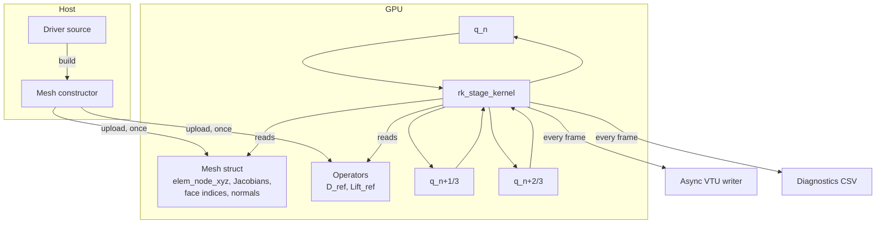

# Architecture

mojoxm is roughly **16 k lines of Mojo + a thin C MPI shim**. The codebase is
organised around four invariants:

1. **GPU-only.** No CPU reference physics, no GPU-vs-CPU diff harness. After
   startup, no host-side array indexed by element, face, or DOF survives.
2. **Comptime polymorphism.** Physics types are compile-time parameters
   (`Solver[PhysT, P]`), so the compiler emits one specialised kernel per
   `(physics, polynomial order)` pair.
3. **Single fused RK kernel** (3D) / **two-launch flux + fused-update** (2D)
   per SSPRK3 stage. No intermediate `rhs` / `face_flux` scratch buffers in
   the 3D path.
4. **Self-consistent validation.** Every kernel is gated by analytic
   reference states or compile-time invariants — never by a CPU diff.

<div class="grid cards" markdown>

-   :material-cube-outline:{ .lg .middle } **[Numerical scheme](numerical-scheme.md)**

    ---

    Lagrange DG at arbitrary P, Kuhn 6-tet decomposition, SSPRK3, the
    fused RK-stage kernel.

-   :material-shape:{ .lg .middle } **[Physics trait](physics-trait.md)**

    ---

    The four hooks every physics module implements; what
    `DevicePassable` means; how to add a new physics.

-   :material-grid:{ .lg .middle } **[2D vs 3D pipelines](2d-vs-3d.md)**

    ---

    Two parallel stacks — split-tet 3D (with MPI) and Kuhn-triangle 2D
    (single-rank GPU). Why both, and when to use which.

-   :material-database-arrow-right:{ .lg .middle } **[Data flow](data-flow.md)**

    ---

    Mesh build, GPU residency, the SSPRK3 loop, async VTU output, and
    diagnostics — one diagram per stage.

</div>

## High-level layout

```
mojoxm/
├── src/                       # ~16 k lines of Mojo + 1 C shim
│   ├── reference.mojo         # 3D reference element (Vandermonde, D, Lift)
│   ├── reference_2d.mojo      # 2D reference triangle
│   ├── mesh.mojo              # patch-aware Mesh[P], MPI partition + halos
│   ├── local_mesh.mojo        # raw periodic Kuhn-tet mesh + BC overlay
│   ├── local_mesh_2d_gpu.mojo     # parent: shared 2D-GPU mesh utilities
│   ├── local_mesh_2d_gpu_*.mojo   # 7 per-module: 5 physics + GLM-MHD + limiter
│   ├── solver.mojo            # Physics trait, rk_stage_kernel, BJ limiter
│   ├── advection.mojo         # PhysT 1: scalar upwind
│   ├── euler.mojo             # PhysT 2: 5-moment + 4 Riemann solvers
│   ├── shallow_water.mojo     # PhysT 3
│   ├── maxwell.mojo           # PhysT 4: vacuum E+B + J/M sources
│   ├── mhd.mojo               # PhysT 5: ideal MHD + Dedner GLM
│   ├── two_fluid.mojo         # PhysT 6: 17-component multiphysics
│   ├── frame_writer.mojo      # async per-frame VTU
│   ├── diagnostics.mojo       # per-frame integrals + allreduce
│   ├── time_integrator.mojo   # SSPRK3 driver loops
│   ├── vtu.mojo / vtu_2d.mojo # zero-copy binary VTU writer
│   └── ...
├── examples/                  # 23 reference drivers
├── benchmarks/                # 124 analytic-gate benches
├── test/                      # 33 unit tests
└── scripts/                   # Python: validate_vtu, animate_dashboard, ...
```

## The mental model



The driver builds a mesh on host, uploads it once, and from then on every
DOF lives on the GPU. The SSPRK3 loop launches one fused kernel per stage,
three times per timestep. Frame I/O happens out-of-band on a pthread.

## Limitations and roadmap

mojoxm is an actively-developed research codebase. Where it is *not*
yet:

- **2D MPI.** The 3D pipeline supports MPI; the 2D pipeline is single-rank
  GPU only.
- **HLLD for MHD.** All MHD paths (2D and 3D) currently use Rusanov flux.
  3D Brio–Wu passes via Rusanov + GLM + BJ limiter; 2D Brio–Wu does not.
  The 2D Kuhn-triangle Rusanov flux produces ~16× faster transverse Bx
  error growth than the 3D split-tet pattern, so HLLD is a real
  requirement for 2D MHD shocks.
- **Adaptive mesh refinement.** Not on the roadmap.
- **Implicit time stepping.** Not planned. The fused single-precision
  SSPRK3 is the explicit-only design point.

What's on the near-term radar:

- 2D MPI ranks with halo exchange parity to the 3D path.
- HLLD Riemann solver for MHD (2D + 3D).
- Phase-3 single-launch fusion for the 2D pipeline (face-flux into the
  vol+lift+RK kernel).
- A `Solver2D` wrapper to mirror the 3D `Solver[PhysT, P]` ergonomics.

## Source-of-truth tables

For exact line counts per file see the
[main repository README](https://github.com/EvanBluhm/mojoxm#system-architecture).
The README is regenerated from source as the codebase evolves; the docs
focus on the conceptual story.
