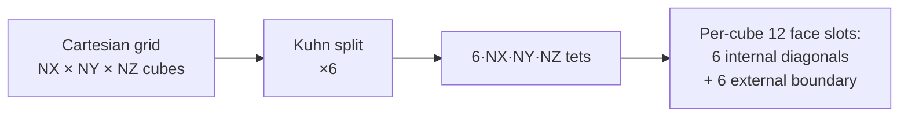
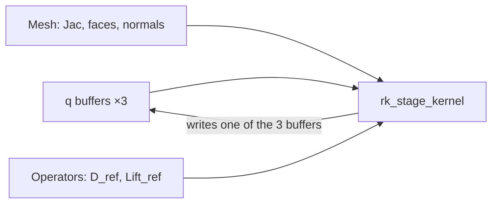

# Numerical scheme

mojoxm solves systems of hyperbolic conservation laws

\[
\frac{\partial \mathbf{q}}{\partial t}
  + \nabla \cdot \mathbf{F}(\mathbf{q})
  = \mathbf{S}(\mathbf{q}, \mathbf{x})
\]

with a **discontinuous Galerkin** spatial discretisation on simplices and an
**explicit SSPRK3** time integrator. Float32 throughout.

## Reference element

For polynomial degree \(P\), the reference tetrahedron carries an
equispaced Lagrange nodal basis with

\[
N_P = \frac{(P+1)(P+2)(P+3)}{6}
\]

nodes — 10 at \(P=2\), 20 at \(P=3\), 35 at \(P=4\), 56 at \(P=5\). The
Vandermonde-inverse approach builds the operators

\[
D_\mathrm{ref}^{(d)} = M_\mathrm{ref}^{-1} \, S_\mathrm{ref}^{(d)},
\qquad
\mathrm{Lift}_\mathrm{ref}^{(f)} = M_\mathrm{ref}^{-1} \, L_\mathrm{ref}^{(f)},
\]

where \(M_\mathrm{ref}\), \(S_\mathrm{ref}^{(d)}\), and \(L_\mathrm{ref}^{(f)}\)
are the reference mass / stiffness / face-lift matrices. Mass and
stiffness entries are computed analytically by the
[Dirichlet integration formula](https://en.wikipedia.org/wiki/Polynomials_on_simplices)
on the reference simplex — no numerical quadrature, no round-off
accumulation in the operator construction.

The full machinery lives in `src/reference.mojo` (3D, 826 lines) and
`src/reference_2d.mojo` (2D triangle). Operator size grows fast: at
\(P=5\) the volume operator alone is ~80 k Float32s.

### VTK compatibility

| P    | VTK cell type             | Cell type id |
| ---- | ------------------------- | ------------ |
| 2    | `VTK_QUADRATIC_TETRA`     | 24           |
| ≥3   | `VTK_LAGRANGE_TETRAHEDRON`| 71           |

The same is true on the 2D side: `triangle6` at \(P=2\), `VTK_LAGRANGE_TRIANGLE`
(cell type 69) at \(P\geq 3\). `make test-vtu-meshio` validates the node
ordering at every supported P.

## Kuhn 6-tet decomposition

The mesh is a Cartesian cell grid with each cube split into 6 tetrahedra by
the Kuhn / Freudenthal decomposition. Two key consequences fall out:

1. **Translation invariance.** All cubes are decomposed identically, so the
   `(tet_local_face, side) → element-local_node` mapping is a small set of
   precomputed tables. No per-cell orientation bookkeeping. No special
   cases for periodic-wrap cells.
2. **Dictionary-free face IDs.** Each cube owns 12 faces uniquely (6
   interior diagonals + 6 external on its +x / +y / +z boundaries). The
   face ID is just `owner_cell * 12 + face_type`.



The 2D pipeline uses **Kuhn-2 triangulation** — each square split on its
diagonal into two right-triangles — with the same translation-invariance
property in 2D.

## Conserved-state layout

The solution vector is a flat Float32 buffer

```
q[(e * N_P + i) * NC + c]
```

where `e` ranges over elements, `i` over nodes within an element, and
`c ∈ [0, NC)` over conserved components. `NC` is a compile-time constant
fixed by the physics type (`PhysT.NUM_COMPONENTS`).

`q` is laid out so that adjacent threads at fixed `(e, i)` walk through
all components — coalesced for the inner-loop-over-components pattern that
dominates Riemann solver kernels.

## Numerical flux

For an interior face with outward normal \(\mathbf{n}\) and left/right
states \(\mathbf{q}_L, \mathbf{q}_R\):

\[
\hat{\mathbf{F}}(\mathbf{q}_L, \mathbf{q}_R, \mathbf{n}) =
  \tfrac{1}{2}\bigl(\mathbf{F}(\mathbf{q}_L) + \mathbf{F}(\mathbf{q}_R)\bigr) \cdot \mathbf{n}
  - \tfrac{1}{2}\,\Lambda(\mathbf{q}_L, \mathbf{q}_R, \mathbf{n})\,(\mathbf{q}_R - \mathbf{q}_L)
\]

is the schematic shape every two-state numerical flux follows. The physics
module owns the dissipation operator \(\Lambda\) — Rusanov uses a single
scalar \(\lambda_\max\), Roe uses the Roe-averaged absolute Jacobian, HLLE
/ HLLEC / HLLC pick wave-speed bounds, and so on.

For boundary faces, the flux is computed against a **BC-synthesised ghost
state** — the physics module's `boundary_flux(q_int, bc_type, n)` hook
either returns a hardcoded analytic flux (e.g. PEC reflection) or
constructs the ghost state and re-uses the interior `numerical_flux`.

## The fused RK-stage kernel { #fused-rk-stage }

A single GPU kernel computes, per `(element, node)`:

1. **Volume term.** \(D_\mathrm{ref} \cdot \mathbf{F}(q)\) using the
   element's inverse Jacobian.
2. **Numerical flux.** Loop over the four faces of the tet; evaluate
   `numerical_flux(q_L, q_R, n)` (or `boundary_flux`) at each face node.
3. **Lift.** \(\mathrm{Lift}_\mathrm{ref}^{(f)} \cdot \hat{F}^{(f)}\) for
   each face, accumulated into the volume RHS.
4. **SSPRK3 linear combination.** Read `q_n`, `q_*`, `q_**` from the three
   buffers; write the new stage.

No `rhs` or `face_flux` scratch buffers — everything stays in registers
(or shared memory at high \(P\)). The kernel is generic over `(NC, PhysT)`
and the compiler emits one specialised version per physics module.



In 2D the kernel is split into two launches per stage — face-flux first
(writes `fstar` to global), then a fused vol+lift+RK kernel that consumes
`fstar` from global and produces the next stage. This is one launch fewer
than the obvious three-launch decomposition; phase-3 fusion (single
launch in 2D) is on the roadmap.

## Time stepping (SSPRK3)

The Shu-Osher 3-stage SSPRK3 scheme is

\[
\begin{aligned}
\mathbf{q}^{(1)} &= \mathbf{q}^n + \Delta t\, L(\mathbf{q}^n) \\
\mathbf{q}^{(2)} &= \tfrac{3}{4}\mathbf{q}^n + \tfrac{1}{4}\mathbf{q}^{(1)} + \tfrac{1}{4}\Delta t\, L(\mathbf{q}^{(1)}) \\
\mathbf{q}^{n+1} &= \tfrac{1}{3}\mathbf{q}^n + \tfrac{2}{3}\mathbf{q}^{(2)} + \tfrac{2}{3}\Delta t\, L(\mathbf{q}^{(2)})
\end{aligned}
\]

requiring three live buffers (`q_n`, two stage scratch). The buffer-routing
dance is non-trivial — every stage reads two buffers and writes a third
in a permuting pattern — and is factored out as
`src/ssprk3.ssprk3_stage_plans`, a non-templated helper shared by every
2D-GPU example and bench (60+ call sites).

The full step driver lives in `src/time_integrator.mojo`:
- `run_ssprk3_loop` — bare time stepping
- `run_ssprk3_loop_with_diagnostics` — same loop with per-frame integral
  reductions and CSV append

## Limiter (shock capture)

A **Venkatakrishnan-smoothed Barth–Jespersen** slope limiter runs after
every RK stage when enabled. It is split into three kernels for both 2D
and 3D:

| Kernel                | Role                                           |
| --------------------- | ---------------------------------------------- |
| `compute_cell_average`| Mass-matrix-weighted cell mean                 |
| `compute_theta`       | Per-element \(\theta \in [0, 1]\) clamping factor |
| `apply`               | Coalesced write of \(\theta \cdot (q - \bar{q}) + \bar{q}\) |

Splitting `apply` out lets adjacent threads share `elem` and stride-1 the
write to `q[]`, eliminating an uncoalesced pattern that previously
dominated. The 2D limiter share grows from ~44% of GPU time at \(P=3\) to
~48% at \(P=4\), then back down to ~45% at \(P=5\) (compute_theta is
O(NP) but the Euler vol+lift+rk kernel scales as NP × NC and pulls
ahead at NP=21 / NC=4). The 3D limiter share *shrinks* monotonically
with P (from ~14% at \(P=3\) to ~11% at \(P=5\)) because the
cooperative `rk_stage_kernel` grows quadratically in NP and absorbs
the budget.

The limiter is gated end-to-end by `bench_euler_sod_limited_*` plus
unit tests `limiter_2d_gpu_test_p{2,3,4,5}` and `limiter_3d_test_p{2,3,4,5}`.
See [Reference · Limiter](../reference/limiter.md) for the full math.

## Validation pyramid

| Level                       | What it gates                                       | Count |
| --------------------------- | --------------------------------------------------- | ----- |
| Unit tests                  | Constant-state preservation, operator round-trips   | 33    |
| Analytic-gate benches       | Closed-form reference states, BC dispatch, sources  | 126   |
| Convergence-rate benches    | Explicit \(\log_2(e_N / e_{2N})\) gates             | 10    |
| Multi-physics gates         | Cross-component invariants (charge, energy, etc.)   | varies|

Every BC dispatch arm in every physics module has at least one direct
benchmark gate. Every supported polynomial order (P=1..5) has parity
coverage across all 5 smooth physics in 2D and 3D, plus shocked Euler at
\(P=2/3/4/5\) in both dimensions and the BJ limiter at \(P=2/3/4/5\).
