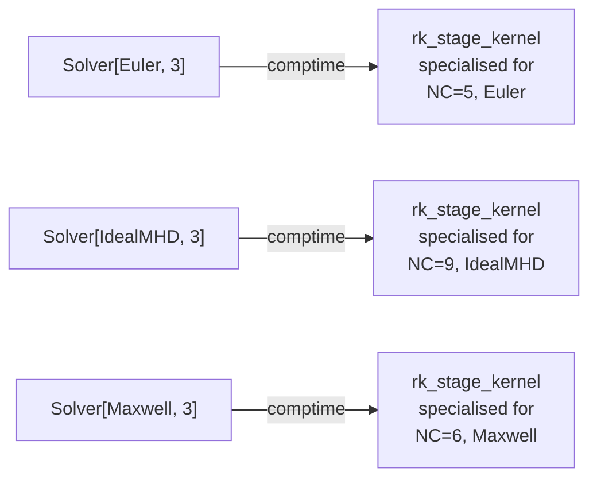

# The Physics trait

Every physics module implements a small, fixed-shape Mojo trait. Once a
module satisfies the contract, the rest of the pipeline — mesh, solver,
SSPRK3 loop, BJ limiter, VTU writer, diagnostics — works without
modification.

## The contract

```mojo
trait Physics(Copyable, Movable, ImplicitlyDestructible, DevicePassable):

    comptime NUM_COMPONENTS: Int

    def internal_flux(
        self, q, flux,
    ) -> Float32: ...
        # writes flux[d * NC + c] = F_d_c(q),
        # returns max-wave-speed estimate (used for CFL)

    def numerical_flux(
        self, q_l, q_r, nx, ny, nz, flux,
    ) -> Float32: ...
        # NC-vector two-sided Riemann flux at a face, for given outward
        # normal n. Returns max wave speed used in dissipation operator.

    def boundary_flux(
        self, q_int, bc_type, nx, ny, nz, flux,
    ) -> Float32: ...
        # Riemann flux against a BC-synthesised ghost state.
        # bc_type ∈ {BC_WALL, BC_OUTFLOW, BC_INFLOW, ...}

    def source_term(
        self, q, x, y, z, source_out,
    ): ...
        # Pointwise S(q, x) added to RHS at every node.
        # Default implementations may zero source_out.
```

## Why `DevicePassable`?

The physics instance is passed **by value** into the RK-stage kernel.
The compiler copies the struct into the kernel's launch parameters,
inlines every method call into the kernel body, and emits one specialised
kernel per `(NC, PhysT)` pair.

This means:

- All physics state must be `Copyable` and trivially device-mappable —
  no host-only references, no GC handles.
- Physics constants (e.g. `gamma` for Euler, `c` for Maxwell, `c_h`
  for GLM cleaning) live as regular fields on the struct and are
  baked into the launch parameters at construction time.
- Compile-time specialisation eliminates dynamic dispatch in the
  inner kernel loop. There is no virtual call to `numerical_flux` —
  the bytes for HLLEC's wave-speed estimator literally exist
  inline at every face-loop iteration of the Euler kernel.



Every cell in the table above is a separate device binary. The trait is the
abstract handle; specialisation is what the compiler does to it.

## What a minimal physics looks like

Scalar advection with constant velocity \(\mathbf{v}\):

```mojo
struct Advection(Copyable, Movable, ImplicitlyDestructible, DevicePassable):
    comptime NUM_COMPONENTS: Int = 1

    var vx: Float32
    var vy: Float32
    var vz: Float32

    def internal_flux(self, q, flux) -> Float32:
        flux[0 * 1 + 0] = self.vx * q[0]      # F_x = v_x * q
        flux[1 * 1 + 0] = self.vy * q[0]      # F_y = v_y * q
        flux[2 * 1 + 0] = self.vz * q[0]      # F_z = v_z * q
        return abs(self.vx) + abs(self.vy) + abs(self.vz)

    def numerical_flux(self, q_l, q_r, nx, ny, nz, flux) -> Float32:
        var v_dot_n = self.vx * nx + self.vy * ny + self.vz * nz
        # Plain upwind
        if v_dot_n >= 0:
            flux[0] = v_dot_n * q_l[0]
        else:
            flux[0] = v_dot_n * q_r[0]
        return abs(v_dot_n)

    def boundary_flux(self, q_int, bc_type, nx, ny, nz, flux) -> Float32:
        # ... dispatch on bc_type
        ...

    def source_term(self, q, x, y, z, source_out):
        source_out[0] = 0.0
```

That's the minimal API. The actual `Advection` adds the BC arms and
returns wave speeds matching `internal_flux`.

## What a complex physics looks like

`FiveMomentTwoFluid` is the heaviest module in the suite — 17 components
covering electron mass + momentum + energy (5), ion mass + momentum + energy
(5), Maxwell E + B (6), and one GLM scalar:

```
q[0..4]    — electron (rho_e, rho_e u_e, rho_e v_e, rho_e w_e, E_e)
q[5..9]    — ion      (rho_i, rho_i u_i, rho_i v_i, rho_i w_i, E_i)
q[10..15]  — Maxwell  (E_x, E_y, E_z, B_x, B_y, B_z)
q[16]      — psi      (GLM scalar for div(B) cleaning)
```

The `source_term` hook does the heavy lifting:

- Lorentz force on each fluid: \(\rho q_s (\mathbf{E} + \mathbf{u}_s \times \mathbf{B})\)
- Joule heating in each energy equation
- Current source \(\mathbf{J} = \sum_s q_s \rho_s \mathbf{u}_s\) coupled into Maxwell's
  equations via the source term, evaluated pointwise per node
- Hyperbolic GLM damping on \(\psi\)

This is roughly 627 lines of Mojo. The `numerical_flux` dispatches to
`Euler.numerical_flux` for each fluid block and to `Maxwell.numerical_flux`
for the EM block, then emits the GLM correction terms in-place. The
two physics modules are *composed* at the source level rather than
re-implemented.

## How to add a new physics

1. **Create `src/<physics>.mojo`** with a struct that satisfies the trait.
   Fix `NUM_COMPONENTS` at compile time.
2. **Pick a numerical flux family** and implement `numerical_flux` and
   `boundary_flux`. Cover every `bc_type` constant from `src/boundary.mojo`
   that you intend to support — start with `BC_WALL` if your problem is
   closed.
3. **(Optional) implement `source_term`.** If unused, write zero.
4. **Add a 3D test driver** under `test/` that uses
   `Solver[YourPhys, 2]` and constant initial state, asserting that the
   state stays constant. This catches almost every flux-conservation bug
   immediately.
5. **Add benches** under `benchmarks/` for any analytic solution your
   physics admits — smooth waves, periodic eigenmodes, Riemann
   problems, etc.
6. **Add a 2D-GPU module** `src/local_mesh_2d_gpu_<physics>.mojo` if you
   want the lower-cost 2D pipeline. It mirrors the 3D structure but
   runs through the 2-launch flux + vol+lift+RK pattern.
7. **Register `make` targets** in the Makefile for the new tests / benches.
   Add them to the relevant aggregator (`bench-bcs`, `bench-rates`, etc.).

## Where each physics lives

| File                       | Physics module        | Components |
| -------------------------- | --------------------- | ---------- |
| `src/advection.mojo`       | `Advection`           | 1          |
| `src/euler.mojo`           | `Euler`               | 5          |
| `src/shallow_water.mojo`   | `ShallowWater`        | 3          |
| `src/maxwell.mojo`         | `Maxwell`             | 6          |
| `src/mhd.mojo`             | `IdealMHD` (NC=9, GLM-capable; set c_h=α_d=0 for plain MHD) | 9 |
| `src/two_fluid.mojo`       | `FiveMomentTwoFluid`  | 17         |

For per-physics formulations, BCs, and benchmark coverage, see the
[Physics section](../physics/index.md).
