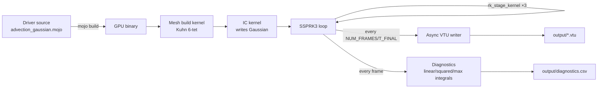

# Your first simulation

The traditional "Hello, world!" of mojoxm is `advection_gaussian` — a smooth
Gaussian pulse advected through a triply-periodic cube. After exactly one
period it should return to its initial condition, modulo round-off. It's
the smallest end-to-end exercise of every part of the pipeline: mesh
build, GPU upload, fused RK kernel, async VTU writer, and the
post-run throughput report.

## Build and run

```bash
make advection_gaussian
./advection_gaussian
```

You should see output broken into three phases:

```
=== Device memory usage ===
  Temporal solver (RK stages): 75.9 MB
  Spatial solvers (DG ops):    2.1 KB
  Cell limiter scratch:        5.1 MB
  Mesh connectivity:           286.0 MB
  ...
  Total device memory:         367.0 MB
===========================

[step    0]  t = 0.0000  ...
[step  100]  t = 0.0481  ...
[step  500]  t = 0.2406  ...
...

=== Step-loop throughput ===
  steps:                50
  DOF / step:           6635520
  wall time:            ~115 ms
  per-step wall:        ~2.3 ms
  throughput:           ~2.9 GDOF/s
  state bandwidth:      ~88 GB/s   (lower bound)
============================
```

The exact numbers depend on your GPU; on an RTX 3090 the full 20-frame
run finishes in **~5.6 s** wall clock, of which only ~0.2 s is GPU
compute — the rest is download + VTU file I/O.

## Inspect the output

The driver writes one VTU per frame plus a `.pvd` collection that
ParaView opens directly:

```bash
ls output/
# solution_0000.vtu  solution_0001.vtu  ...  solution_0020.vtu
# solution.pvd       diagnostics.csv
```

Open `output/solution.pvd` in [ParaView](https://www.paraview.org/) for an
interactive browser. Or use the bundled animated dashboard:

```bash
pixi run python scripts/animate_dashboard.py
# writes output/dashboard.gif
```

The dashboard is a 2×2 GIF: a thin-z slice of the leading scalar plus
three time-series panels auto-grouped from the diagnostics CSV (mass /
momentum-style / energy-style).

## What just happened?



1. **Mesh build (host → GPU).** The driver constructs a `Mesh[P=2]` from a
   Cartesian cube. Two GPU build kernels populate the device-resident
   element / face / Jacobian arrays. After this point, no host-side array
   indexed by element, face, or DOF survives.
2. **Initial condition.** The driver's IC kernel reads the resident node
   coordinates and writes `q[c=0]` directly on device.
3. **Time stepping.** The fused
   [`rk_stage_kernel`](../architecture/numerical-scheme.md#fused-rk-stage)
   runs three times per step — one launch per SSPRK3 stage. Volume DG term,
   numerical flux, and the RK linear combination all happen in one kernel.
4. **Output.** Every `T_FINAL / NUM_FRAMES` interval, one component is
   downloaded and `writev()`'d out as a binary-appended VTU. The async
   writer overlaps file I/O with the next compute window, up to 8 frames
   in flight.
5. **Diagnostics.** A `DiagnosticsWriter` integrates conserved
   quantities each frame and (at np>1) `MPI_Allreduce`s them before rank 0
   appends one CSV row.

## Try a different physics

Every example driver follows the same shape. Drop in a different one:

| Driver                             | Physics                       | What it shows                                    |
| ---------------------------------- | ----------------------------- | ------------------------------------------------ |
| `./euler_vortex`                   | Euler (HLLEC)                 | Isentropic vortex, periodic, smooth-flow gate    |
| `./euler_sod`                      | Euler (HLLC + BJ limiter)     | Smoothed Sod tube with non-periodic BCs          |
| `./mhd_alfven`                     | IdealMHD + GLM                | Polarised Alfvén wave, periodic                  |
| `./two_fluid_langmuir`             | FiveMomentTwoFluid            | Electron plasma oscillation, omega_p match       |
| `./advection_gaussian_2d_gpu`      | Advection (2D triangles)      | Smaller, faster smoke run on the 2D pipeline     |

The full catalogue is in [Usage · Examples](../usage/examples.md).

## Next

- [Quickstart cheatsheet](quickstart.md) — the daily-use `make` targets
- [Architecture overview](../architecture/index.md) — how it all fits together
- [Physics](../physics/index.md) — pick a module and read the formulation
